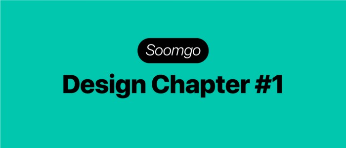
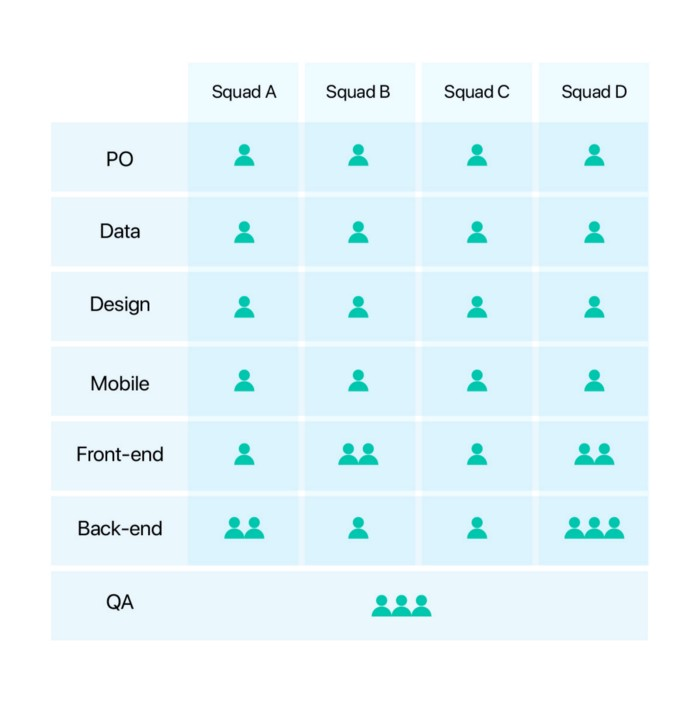
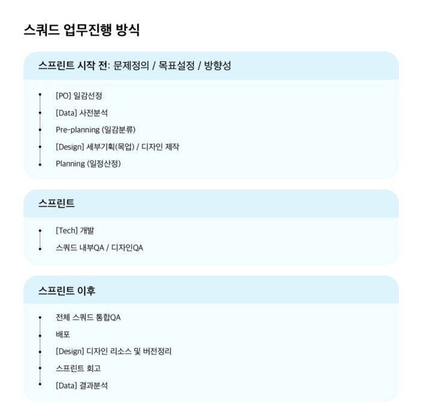
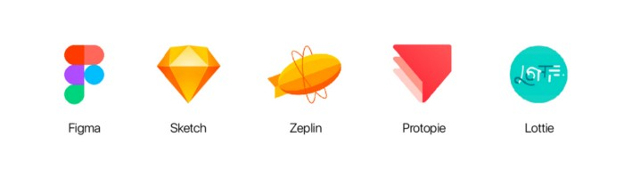
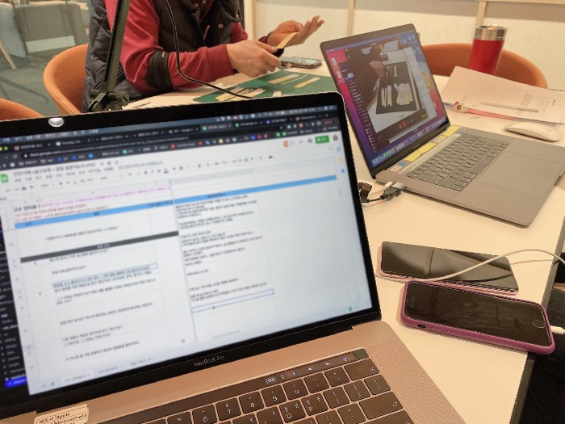

안녕하세요! 저는 숨고에서 Product designer로 일하고 있는 summer입니다.

숨고에서 어떤 고민을 하면서 제품을 만드는지 공유하기 위해 앞으로 미디엄을 통해서 이야기를 전달 드리고자 합니다.

첫 번째 주제는 **숨고의 구성원의 조직 구조와 업무 방식**입니다.

# 프로덕트 디자이너가 하는 일은?

**숨고의 프로덕트 디자이너는 숨고라는 제품을 만드는 전반적인 프로세스에 기여합니다.**

프로덕트 디자이너와 UX/UI 디자이너와 다른 점은 오너쉽을 갖고 회사의 방향성에 맞춰서 비지니스 적인 부분까지 제품을 전반적으로 고민하고, 프로덕트를 주체적으로 이끌어나가며 기획과 설계를 하고, 문제해결을 진행하는 점이 다르다고 할 수 있습니다. 회사 또는 조직마다 다를 수 있지만 기획자가 만든 기획안을 보며 작업하는 UX/UI 디자이너랑은 결이 조금 다릅니다.

**숨고는 Data-driven 방식으로 업무를 진행하고 있습니다.** 이 방식은 개선할 점 또는 문제점을 선정하고 가설을 세운 뒤 프로덕을 개선하여 데이터로 증명하는 방식입니다.

**디자인 챕터는 스쿼드의 목표, 숨고의 비지니스 방향성과 사용성 개선을 목적으로 숨고의 사용자인 고수 또는 고객에게 어떠한 경험을 만들지 고민합니다.**

  
_Photo by <u>[Scott Graham](https://unsplash.com/@homajob?utm_source=medium&utm_medium=referral)</u> on <u>[Unsplash](https://unsplash.com/?utm_source=medium&utm_medium=referral)</u>_

실제 디자인 챕터에서 고민했던 내용들을 예시로 보여드리면 아래와 같습니다.

> -방금 가입한 고수에게 어떤 것들을 제공해야 숨고를 만족하고 계속 이용할 수 있게 할까?  -채팅방에 어떤 기능이나 안내를 넣어야 고객들이 고수들의 견적을 보고 답변을 더 많이할까? -고수 프로필 페이지를 어떻게 구성해야 고수들이 더 완성도 있게 만들까? -이 버튼을 어떠한 명칭으로 정해야 고객, 고수들이 더 많이 누르게 될까? -요청서를 작성하고 어떤 장치를 넣으면 페이지에 더 머무르며 고수 리스트를 비교할까?

이러한 문제점에 대한 고민을 바탕으로 프로덕을 만들고 있습니다.

# 숨고 에자일 인원 구성 방식은?

숨고는 에자일(agile)방식으로 업무를 진행하고 있는데요, 간단하게 말하자면 **에자일은 빠르게 제품에 변화를 주어 유연하고 신속하게 대응하는 업무 방식입니다.**

  
_숨고의 에자일 운영 방식 설명_

에자일 멤버들의 챕터 구성은 위 이미지처럼 같은 분야끼리 나뉘어있고, 각각의 챕터원들이 모여 스쿼드를 이뤄 작업하고 있습니다.

숨고에는 현재 4개의 스쿼드가 운영되고 있으며 각자 스쿼드의 목표와 방향성을 바탕으로 일감을 선정하여 업무를 진행합니다.

# 스쿼드 업무 진행 방식과 프로덕트 디자이너가 하는 일, 그리고 사용하는 툴은?

  
_숨고 업무진행 방식_

제가 속한 스쿼드를 기준으로 업무 프로세스에 대해서 간단하게 표현해보았는데요. 모든 스쿼드가 이렇게 진행되지는 않아서 참고만 하시면 좋을 것 같습니다.

PO(Product owner)가 제시하는 스쿼드의 방향성에 맞춰 일감을 선정하고, BA(Business analyst)가 해당 일감에 대해 사전분석한 내용을 바탕으로 Pre-planning을 진행합니다.

Pre-planning에서는 스프린트에 알맞은 일감인지, A/B test 진행을 할 것인지, 임팩트와 프로덕의 방향성 등을 확인하여 다음 스프린트에 진행할 스토리 또는 에픽을 선정합니다.

  
_숨고 디자인챕터에서 사용하는 툴_

**프로덕트 디자이너는 진행할 일감의 목적을 파악하고 어떻게 문제를 해결하고, 사용성을 변화시킬지 고려하며** Figma로 세부기획을 하며 화면 목업을 만듭니다. 목업을 바탕으로 방향성이 정해지면 Sketch로 디테일하게 디자인하고 Zeplin을 통해 공유합니다. 관련된 세부 정책은 Figma 아트보드 옆에 기입하여 다른 스쿼드원들이 이해할 수 있도록 업데이트합니다.

어려운 애니메이션 또는 설명하기 어려운 인터랙션이 있을 때는 Protopie로 프로토타이핑을 하기도 하고, After effect를 이용한 Lottie 애니메이션도 필요에 따라 사용하기도 합니다.

개발이 완료된 후에는 QA를 진행하며 점검하고, 배포된 이후에는 배포관리 시트에 정리하고 작업한 스케치 파일들을 정리하고 공유해서 다른 디자이너가 추후 작업을 할 때 원활하게 이용할 수 있도록 합니다. (프로덕디자이너끼리 매주 각각 스쿼드의 작업 진행 상황을 공유하여 전체적인 프로덕의 변화를 이해하는 시간을 갖습니다.)

배포되고 테스트 기간 이후에는 BA가 데이터를 분석하여 프로덕에 어떠한 변화를 줬는지 점검하고 A/B test 결과를 정리합니다. A/B test 사례는 나중에 기회가 되면 더 자세히 설명하도록 하겠습니다.

**업무방식은 꾸준히 회고하는 시간을 가지면서 더 좋은 방식을 찾고 효율적으로 일하기 위해 노력하기 때문에 꾸준히 변화하고 있습니다.** 😀

최근에는 데이터 분석과 더불어 User test를 진행하며 실제 숨고를 이용하시는 고수, 고객님의 목소리를 더욱 가까이서 듣기 위해 노력하고 있습니다. UX리서쳐가 진행하는 in-depth 인터뷰를 관찰하고 기록에 참여하기도 합니다.

UT를 통하여 Data를 이용한 정량적인 분석 뿐만 아니라 정성적인 분석도 함께 진행하여 향후 프로덕의 방향성 및 개선사항에 대해 고민하고 있습니다.

읽어주셔서 감사합니다.🙇‍♀️
