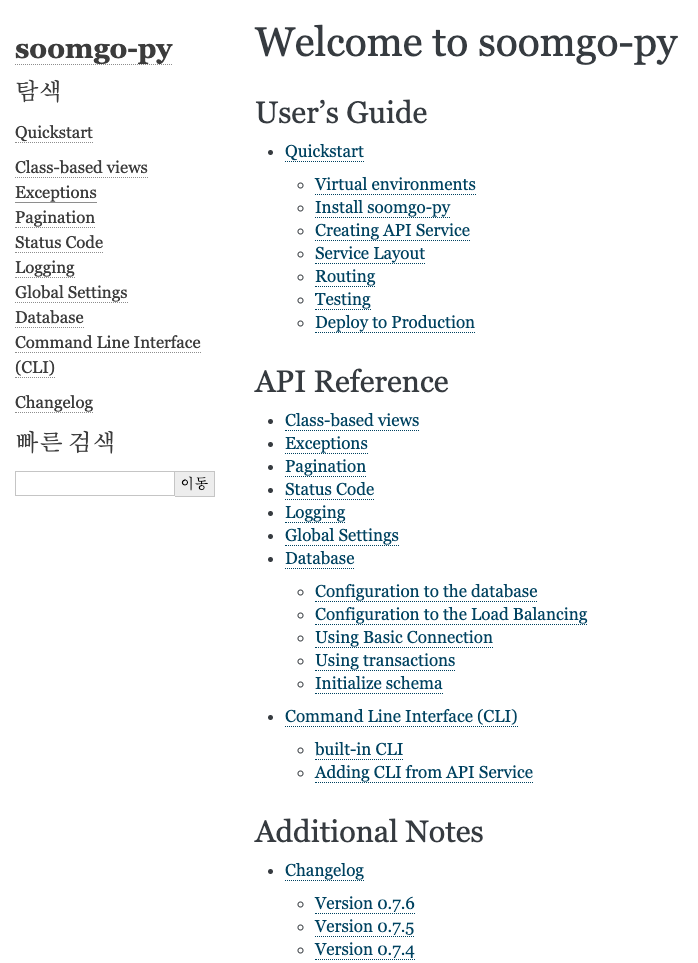

안녕하세요. 숨고 백엔드 엔지니어 Paul 입니다.

이번 포스팅 에서는 숨고 백엔드 챕터 내부에서 제작한 MSA Architecture를 위한 프레임워크 **Soomgo-py**에 대해 기록하려 합니다.

Soomgo-py는 기본적으로 API 전용 프레임워크인 Falcon을 기반으로 제작 되었고, 현재 이를 이용하여 많은 서비스들이 만들어졌습니다.

숨고의 서비스 규모가 성장하고 요구 사항이 많아지면서 이에 적합한 MSA Architecture를 검토하고 있었고 긴 시간 분석을 통해 숨고 전용의 MSA 프레임워크인 Soomgo-py를 만들어보기로 결정했습니다.

아래는 Soomgo-py 프레임워크가 탄생하게된 대표적인 배경 세 가지입니다.

- 서비스별로 존재하는 중복된 코드 및 모듈
- 매번 프로젝트를 설정하는 번거로움
- 낙후되어 관리하기 어려워진 레거시

# 서비스별로 중복된 코드 및 모듈

업계에 알려진 유명한 이론으로 프레임워크 구축 기준을 제시한 규칙이 있습니다. _Rule of Three_ 라는 이 규칙은 최소 3번 이상 재사용 된다면 프레임워크를 구축할 수 있다는 말입니다.

우리 모두가 알다시피 대부분의 Restful API의 요청/응답은 비슷하게 동작합니다. 이는 재사용 가능한 모듈로 만들어서 관련 인터페이스를 제공할 수 있다는 것을 의미합니다. 특정 리소스를 등록한다는 Post 메소드를 예로 들자면

- 클라이언트가 특정 endpoint로 요청
- payload에 대한 validation 이후 비즈니스 로직 수행
- 처리 결과에 대한 응답

대부분의 제품 코드가 이보다 더 복잡할테지만 크게 본다면 위 단계를 벗어나지 않습니다. 이를 위하여 Soomgo-py에서는 장고의 CBV(Class-Based View)와 유사한 컨셉으로 구현하였습니다.

다음의 코드는 Soomgo-py 프레임워크에서 제공한 CreateResource를 사용여 DB에 샘플리소스를 저장하는 소스코드 입니다.

```py
class SampleCreateResource(CreateResource):
model = SampleModel
serializer = SampleSchema
validation_schema = SampleValidationSchema
authentication_classes = [token_authentication]

    def serializer_data(self, objects):
        return {'items': [{'id': o.id} for o in objects]}
```

위 코드는 매우 간단한 예제입니다. CreateResource를 상속받아 클래스 속성(Class Attribute) 들을 선언하는 것만으로 특정 리소스를 저장합니다.

물론, 필요하다면 메소드를 오버라이딩하여 확장할 수도 있습니다.

# 매번 프로젝트를 설정하는 번거로움

서비스가 상용(Production) 레벨에서 운용되기 위해 API Endpoint controller만 필요한 게 아닙니다. 숨고에서는 실제로 서비스의 가용성(Availability)을 위해 다양한 도구들을 사용하고 있습니다.

예를 들면, 모니터링을 위한 NewRelic, 이슈 트래킹을 위한 bugsnag 그리고 docker, k8s, black, flake8 등. 이런 모든 도구의 실행을 위해 Soomgo-py에서는 createapp 커맨드를 통해 각 도구의 설정을 자동으로 초기화 해줍니다.

이로인해 엔지니어는 비즈니스 로직 이외에 다른 환경적인 이슈를 신경 쓰지 않아도 됨으로 생산성은 증가하고 실수는 감소합니다. 아래는 createapp 커맨드를 사용하여 프로젝트가 되는 동영상입니다.

<div style="padding:50% 0 0 0;position:relative;">
    <iframe src="https://player.vimeo.com/video/474326664?h=4884da4e16" style="position:absolute;top:0;left:0;width:100%;height:100%;" frameborder="0" allow="autoplay; fullscreen; picture-in-picture" allowfullscreen></iframe>
</div>

# 레거시 모델

어느 서비스에나 레거시 모델은 존재합니다. 마찬가지로 숨고에서도 MSA로 옮겨지지 못하고 이전 장고(Python Django)로 구현된 레거시 모델이 존재합니다.

이 레거시 모델을 Soomgo-py에서 관리함으로써 MSA 서비스에서는 더 이상 레거시 모델에 대한 어떠한 관리도 할 필요가 없어졌습니다.

. . .

앞서 언급한 필요성 이외에도 Soomgo-py를 구축한 이유는 다음과 같고 실제로도 같은 이득을 얻고 있습니다.

1. 엔지니어의 생산성 증가
2. 일관성 있는 구조 및 코드로 유지보수성 향상
3. 중복 코드 최소화
4. 더 나은 서비스 품질을 위하여



# Soomgo-py 프레임워크의 장점

다음은 Soomgo-py 프레임워크가 가지고 있는 장점입니다.

1. **사용성(Usability)**: 훌륭한 프레임워크 일지라도 사용성이 떨어진다면 비즈니스 로직을 구현 함에 있어 장애물이 될 수 있습니다. Soomgo-py는 러닝 커브를 최소화하고자 상세한 문서화, 장고 CBV와 유사한 메소드 및 동작 패턴, Sample 코드 등을 도입하여 사용성을 높였습니다.


간단한 파일, 코드 추가로 CLI(Command Line Interface)를 구현할 수 있습니다. 아래 동영상은 test CLI를 추가한 영상입니다.

<div style="padding:50% 0 0 0;position:relative;">
    <iframe src="https://player.vimeo.com/video/474518629?h=94a13a3ecd" style="position:absolute;top:0;left:0;width:100%;height:100%;" frameborder="0" allow="autoplay; fullscreen; picture-in-picture" allowfullscreen></iframe>
</div>

2. **확장성(Extensibility)**: 다형성을 통해 인터페이스에 대한 확장이 가능하도록 설계 되었고 인터페이스 이외에도 라이브러리에 대한 확장이 가능하도록 설계 되었습니다.

예를 들어, WSGI로 Gunicorn를 사용 중인데, 이 외에 Uvicorn을 사용해야 한다면 Settings.WSGI_SERVER의 값을 ‘uvicorn’으로 변경하는 것으로 쉽게 다른 환경을 선택할 수 있습니다.

```py
class BaseWSGI(ABC):
...

class GunicornWSGI(BaseWSGI):
...

class UvicornASGI(BaseWSGI):
...

class WSGIFactor:
    @staticmethod
    def server(app):
        wsgi = settings.WSGI_SERVER
        if wsgi == 'gunicorn':
            return GunicornWSGI(app).run()
        elif wsgi == 'uvicorn':
            return UvicornASGI(app).run()
        else:
            raise WSGIServerError
```

3. **재사용성(Reusability)**: 재사용 가능한 모듈을 제공함으로써 생산성을 증가 시킵니다. Soomgo-py 안에는 DB Connection polling, Cursor-Based Pagination, Offset-Based Pagination, logging같은 유용한 모듈들이 기본적으로 내장되어 있습니다.

Soomgo-py는 외부에 오픈소스로 공개된 프레임워크는 아니지만 교육 목적을 포함한 여러 목적을 위하여 외부에 제공될 가능성이 있습니다.

이후 방향을 고민 해본다면 좀 더 강력한 프레임워크로 발전시키기위해 더 많은 기능(자동 redoc, swagger, async 등)을 추가하여 지속적으로 확장될 예정입니다.

Soomgo-py 프레임워크를 모두가 쓸만하도록 개선하여 오픈소스로 여러분들을 만날 수 있도록 준비하겠습니다. 감사합니다.
