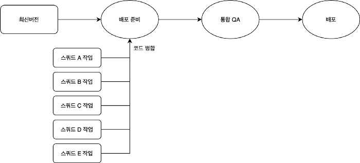
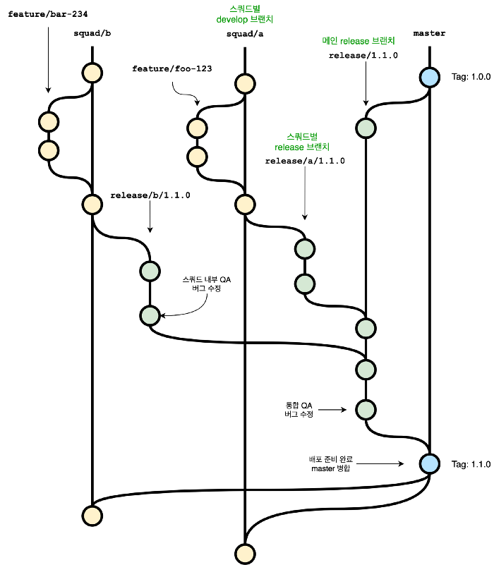
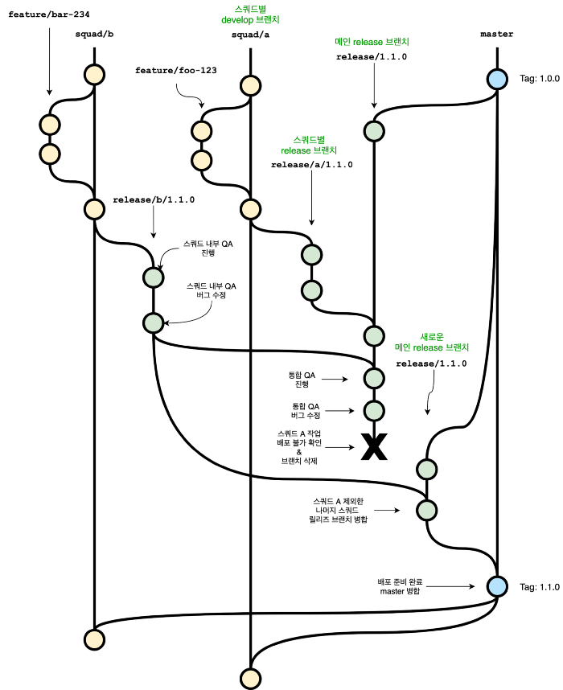
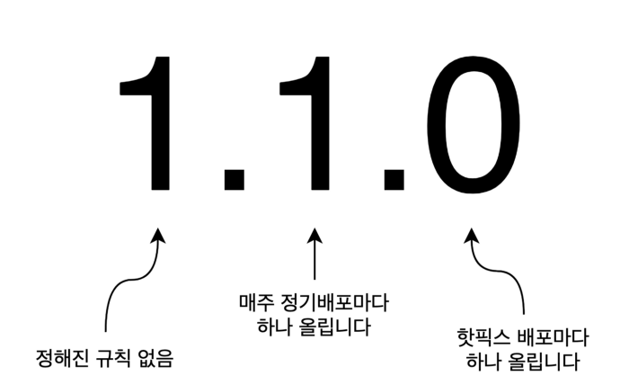

  
_photo by <u>[NASA](https://unsplash.com/@nasa?utm_source=medium&utm_medium=referral)</u> on <u>[Unsplash](https://unsplash.com/?utm_source=medium&utm_medium=referral)</u>_

안녕하세요. 숨고 모바일 챕터에서 리액트 네이티브 앱 개발을 하는 Jimmy입니다.

숨고에서는 매주 수요일마다 정기적으로 제품을 배포하고 있는데요. 모바일 앱, 웹, 서버 모두 예외는 없습니다. <u>각기 다른 목표를 가진 여러 스쿼드</u>에서 작업한 일감들이 병합된 뒤 함께 배포되고 있습니다.

이 글에서는 숨고의 배포 일정과 모바일 챕터에서 매주 모바일 앱을 배포하기 위해 정한 규칙들에 대해 소개합니다.

# 배포 일정

먼저 배포 일정입니다. 매주 수요일 배포하기 위해 아래 단계들을 순서대로 거치고 있습니다.

  
_스쿼드별로 작업한 코드가 병합되어 배포됩니다_

1. 배포 준비: 매주 금요일까지 스쿼드별로 다음 주 수요일에 배포할 내용이 있다면 자체적으로 QA를 진행하고 각 스쿼드 작업분을 병합
   (모든 스쿼드가 매주 배포하는건 아닙니다)
2. 통합 QA: 월, 화요일 이틀간 병합한 상태를 기준으로 QA를 진행
3. 배포: 통합 QA에서 배포 승인받은 후 수요일에 배포

  
_각 단계의 기간을 달력에 나타낸다면 이런 양상입니다_

# Git 브랜칭 모델

매주 여러 스쿼드에서 작업한 내용을 일관되게 병합하고 배포하기 위해서는 규칙이 필요했고, 이 규칙이 될 Git 브랜칭 모델은 Git flow를 기반으로 조금 변형한 것을 선택했습니다.

Github flow가 아닌 Git flow를 기반으로 하는 이유는 모바일 앱 특성상 여러 버전을 지원해야 하는데 이를 더 잘 표현하기 때문이었고, 변형이 필요했던 이유는 우리의 요구사항을 Git flow가 커버하지 못하기 때문이었습니다. 요구사항은 다음 두 가지였습니다.

- 매주 정해진 요일에 배포할 수 있어야 할 것
- 하나 이상의 스쿼드에서 작업한 내용이 배포하지 못하게 될 경우에도 나머지 스쿼드에서 작업한 내용은 계획대로 배포되어야 할 것

Git flow는 롤백하는 경우를 지원하지 않기 때문에 두 번째 요구사항을 해결하기 어려웠습니다.

# 특정 스쿼드의 작업내용을 배포할 수 없게 되는 경우

통합 QA 단계에서 특정 스쿼드의 작업내용을 배포할 수 없게 되는 경우는 발견된 버그가 빠르게 수정될 수 없거나 스쿼드 내부사정으로 배포를 연기해야 하는 등의 상황에 발생합니다. 나머지 스쿼드의 작업이 계획대로 배포되려면 이미 병합된 상태에서 해당 스쿼드의 변경 점만 롤백해야 합니다. 하지만 Git flow는 이런 상황을 지원하지 않고 있습니다.

  
_통합 QA 단계에서 특정 스쿼드의 작업을 배포할 수 없게 된 경우_

우리는 나머지 스쿼드의 작업을 계획대로 배포할 수 있도록 해야 했고, 이를 브랜칭 모델을 통해 해결하고 싶었습니다. 그래서 Git flow의 develop 브랜치를 없애고, 스쿼드별 develop 브랜치를 사용하도록 했습니다. (네이밍 규칙은 `squad/{스쿼드명}`입니다) 이때 배포과정에서 일어나는 브랜칭은 아래와 같습니다.

  
_통합 QA 단계에서 문제가 발생하지 않았을 경우_

  
_통합 QA 단계에서 배포 불가능한 스쿼드 작업이 발생한 경우_

1. 스쿼드별로 다음 배포에 포함할 내용을 스쿼드별 develop 브랜치에 병합
2. 다음 배포를 준비하기 위해 메인 release 브랜치와 스쿼드별 release 브랜치를 생성
3. 스쿼드별 release 브랜치를 기준으로 스쿼드 내부 QA 진행
4. 메인 release 브랜치에 스쿼드별 release 브랜치를 병합
5. 메인 release 브랜치를 기준으로 통합 QA를 진행
6. (문제가 발생한 경우) 특정 스쿼드 작업내용이 배포될 수 없게 된 경우: 메인 release 브랜치를 제거 및 재생성-> 나머지 스쿼드 develop 브랜치를 병합 -> QA 진행
7. QA가 문제없이 끝났으면 메인 release 브랜치를 master 브랜치에 병합
8. master 브랜치를 기준으로 배포
9. 스쿼드별 develop 브랜치에서 master 브랜치를 pull

Git flow 대비 사용하는 브랜치 수가 늘어 복잡해졌지만, 곧잘 익숙해졌습니다. 특정 스쿼드에 문제가 생기면 어떻게 해야 할지가 정해져 있고 그 비용이 상대적으로 작은 점이 이 모델이 갖는 장점이라고 할 수 있습니다.

# 버저닝 규칙

잦은 배포에서 일관되게 버전을 관리하려면 규칙이 필요했습니다.

버저닝 규칙은 어떤 상황에서 어떻게 버전을 올리는지에 대한 명세입니다. 이 규칙이 있으면 버전으로부터 정보를 얻을 수 있고, 자동화하는데에도 도움을 줄 수 있습니다.

정한 규칙은 두가지입니다.

- 정기 배포인 경우 minor 버전을 하나 올립니다.
- 핫픽스 배포인 경우 patch 버전을 하나 올립니다.

단순하지만 이런 규칙을 정하면 핫픽스 배포 발생 유무와 관계없이 다음 정기 배포될 버전을 결정할 수 있는 등의 이점을 얻을 수 있습니다.

모바일 챕터에서는 이렇게 배포를 위한 규칙을 정해 일관되게 작업하여 매주 배포를 위해 필요한 의사결정과 지속적인 통합 비용을 줄이는 경험을 할 수 있었습니다. Git flow로 커버되지 않는 유즈케이스를 위해 더 많은 브랜치를 사용하게 된 것이 오히려 발목을 잡지 않을까 하는 걱정도 있었지만 실제로는 별문제가 되지 않았습니다. 더 나아가 이러한 규칙이 배포 자동화를 구현하는데에도 도움이 되었습니다.
