  
_Photo by <u>[Lenny Kuhne](https://unsplash.com/@lennykuhne?utm_source=medium&utm_medium=referral)</u> on <u>[Unsplash](https://unsplash.com/?utm_source=medium&utm_medium=referral)</u>_

안녕하세요. 숨고 모바일 챕터에서 리액트 네이티브 앱 개발을 하는 Jimmy입니다.
숨고에서는 매주 수요일마다 정기적으로 제품을 배포하고 있는데요. 모바일 앱, 웹, 서버 모두 예외는 없습니다. <u>[각기 다른 목표를 가진 여러 스쿼드]()</u>에서 작업한 일감 들이 병합된 뒤 함께 배포되고 있습니다.
<u>[이전 글]()</u>에 이어서 이 글에서는 숨고에서 모바일 앱을 일반 사용자와 내부 테스터에게 배포하는 방법에 대해 소개합니다.

# QA를 거쳐 배포하기

숨고에서 개발자가 작업한 코드는 두 번의 QA를 통과한 뒤에 배포되고 있습니다. 첫 번째는 스쿼드 내부 QA, 두 번째는 통합 QA 입니다.

**MS 앱센터**

QA를 진행하기 위해서는 내부 테스터들에게 최신 버전의 앱을 배포해야 합니다. 이를 위한 플랫폼으로는 MS 앱센터를 사용하고 있습니다.

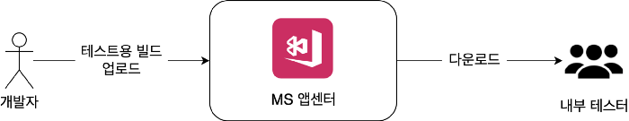
_MS 앱센터를 통해 내부 테스터에게 앱 전달_

**스쿼드 내부 QA**

각 스쿼드에서 작업한 코드는 통합 QA를 받기 전에 스쿼드 내부 QA를 진행합니다. 이 단계에서는 스쿼드 구성원(개발자, 디자이너, PO 등)들이 함께 스쿼드 내에서 진행한 일감이 정상적으로 동작하는지를 확인합니다. 개발자는 앱센터를 통해 스쿼드원들에게 테스트할 버전의 앱을 전달하고, 수정이 필요할 경우 새 버전을 다시 전달하게 됩니다.

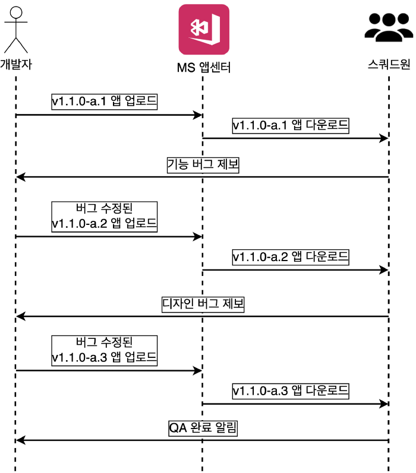  
_스쿼드 A에서 내부 QA를 하는 과정. 버전 identifier의 ‘a’는 스쿼드 이름입니다_

**통합 QA**

스쿼드 내부 QA가 완료된 코드들은 하나로 병합된 뒤 통합 QA를 진행합니다. 이 단계에서는 QA 챕터에서 코드들을 병합한 뒤에도 사이드 이펙트 없이 각 스쿼드의 작업이 잘 동작 하는지 확인하고, 숨고 서비스의 중요한 기능들이 잘 동작 하는지를 확인합니다.

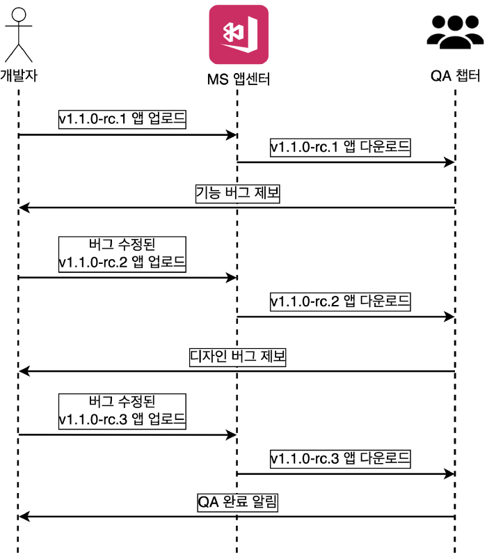  
_통합 QA를 하는 과정_

**일반 사용자에게 배포**

통합 QA가 완료되면 배포 준비가 완료된 것으로, 마켓을 통해 일반 사용자에게 배포하게 됩니다.

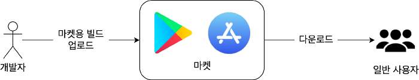  
_마켓을 통해 일반 사용자에게 앱 전달_

# 쉽게 배포하기

내부 테스터와 일반 사용자에게 새 버전의 빌드를 배포할 때마다 어딘가에서는 다음 작업들을 진행해야 합니다.

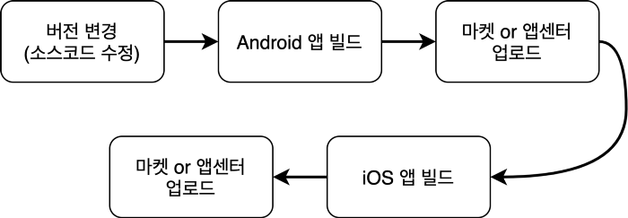  
_숨고에서는 리액트 네이티브를 사용하기때문에 한번에 두가지 앱을 배포하게 됩니다_

개발자가 직접 이 작업들을 하려면 적게 잡아도 3~40분은 필요할 텐데요, 외부에서 자동으로 수행하게 하면 개발자의 능률을 높이고 잦은 배포도 쉽게 할 수 있습니다.

그래서 우리는 이런 것들로 자동화를 하고 있습니다:

- **버전 변경 스크립트:** 버전을 수정하고, git 태그를 생성하는 스크립트 사용
- **CircleCI:** 클라우드에서 빌드와 배포를 수행

# 버전 변경 스크립트

스크립트로 이런 반복 작업을 처리합니다:

- Android, iOS 설정 파일, package.json의 버전 이름과 버전 코드를 현재 브랜치와 버전을 기준으로 규칙에 따라 동일하게 수정하기
- 새 버전으로 git 태그 생성하기

스크립트는 package.json에 선언되어있고 이렇게 호출하면 버전 변경이 완료됩니다.

```zsh
npm run version:bump
```

Android, iOS 설정 파일은 스크립트 내부에서 [react-native-version](https://github.com/stovmascript/react-native-version)을 이용해서 package 버전을 따라 수정하도록 되어있습니다.

버전을 변경한 뒤 리모트로 푸시하면 CircleCI에서 배포가 시작됩니다.

# CircleCI

클라우드에서 자동으로 빌드와 배포를 하기 위해 CircleCI를 사용하고 있고 워크플로우는 두 가지가 설정되어있습니다:

- **pre-release 워크플로우:** 테스트용 빌드를 수행하고 앱센터에 배포
- **release 워크플로우:** 마켓용 빌드를 수행하고 마켓에 배포

워크플로우는 git 태그가 리모트에 푸시되면 시작됩니다. 태그가 release 버전(SEMVER 규칙상)이면 release 워크플로우가, pre-release 버전이면 pre-release 워크플로우가 시작됩니다.

**pre-release 워크플로우**

pre-release 워크플로우가 시작되면 CircleCI에서 앱센터 코드 푸시를 통해 배포를 시작함과 동시에 슬랙을 통해 개발자에게 네이티브 앱으로도 배포 할지 물어봅니다. 개발자가 승인할 경우 코드 푸시, 네이티브 앱 모두 배포됩니다. 배포 대상은 내부 테스터입니다.

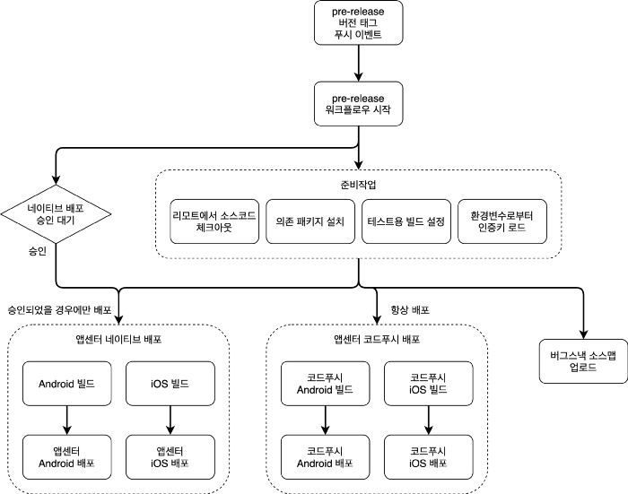  
_흐름_

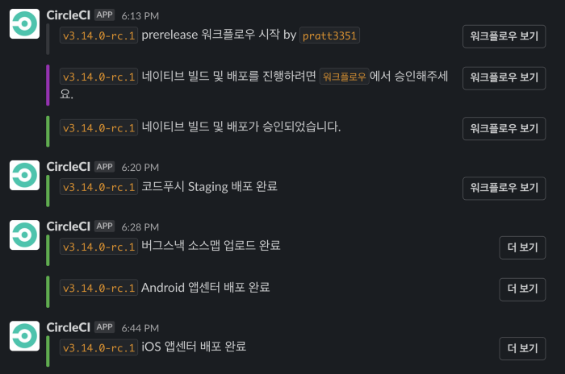  
_발송되는 슬랙 메세지_

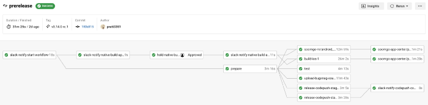  
_CircleCI 웹 인터페이스에서는 이런 모습입니다_

**release 워크플로우**

release 워크플로우가 시작되면 CircleCI에서 슬랙을 통해 개발자에게 배포할 플랫폼을 물어봅니다. 플랫폼을 선택하면 일반 사용자에게 배포가 이루어집니다.

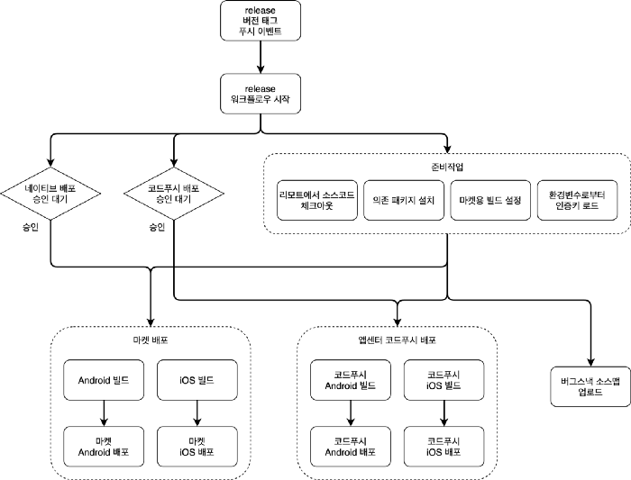  
_흐름_

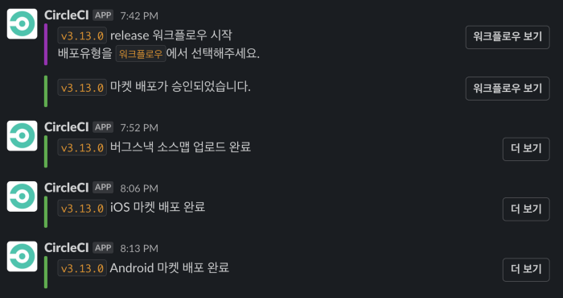  
_발송되는 슬랙 메세지_

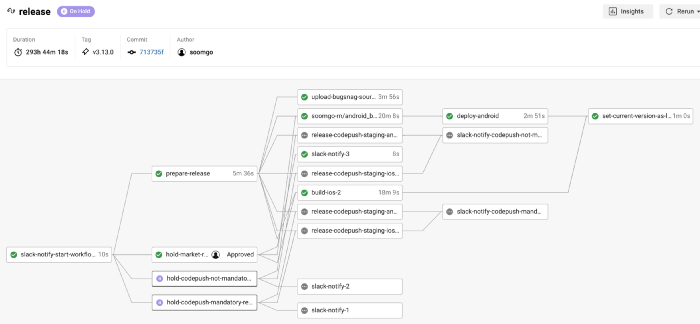  
_CircleCI 웹 인터페이스에서는 이런 모습입니다_

이렇게 숨고에서는 배포 과정을 자동화 함으로써 이런 경험을 할 수 있었습니다.

- 개발자들이 배포를 신경 쓰지 않고 개발에 집중
- 새로 합류한 개발자도 쉽게 배포
- 배포에 필요한 반복 작업들을 쉽고 일관되게 처리
