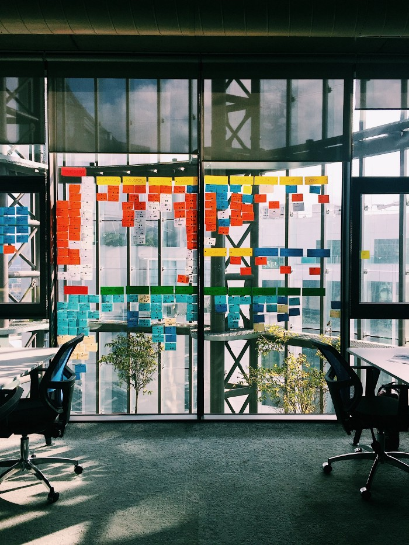
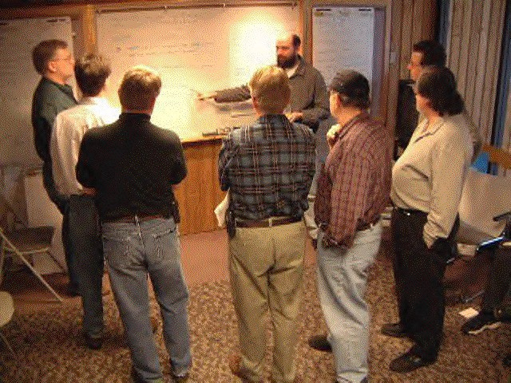

  
_Photo by <u>[Irfan Simsar](https://unsplash.com/@irfansimsar?utm_source=medium&utm_medium=referral)</u> on <u>[Unsplash](https://unsplash.com/?utm_source=medium&utm_medium=referral)</u>_

안녕하세요. 숨고 모바일 챕터에서 리액트 네이티브 앱 개발을 하는 Jimmy입니다.

숨고에서는 더 좋은 제품을 만들기 위해 애자일 프로세스로 일하고 있습니다. 이 글에서는 애자일 프로세스의 근본이 되는 ‘애자일 소프트웨어 개발 선언문’에 대해 소개합니다.

# 애자일 소프트웨어 개발 선언문

  
_2001년 2월, Light Weight Methods Conference에서 애자일 소프트웨어 개발이 논의되는 모습_

2000년경 많은 소프트웨어 팀이 효율적인 프로세스 없이 일했고, 그로 인해 개발자는 예측 불가능 / 반복되는 에러 / 노력의 낭비를, 고객은 스케줄 지연 / 예산 증가 / 낮은 품질을 경험하고 있었습니다.

이를 해결하기 위해 켄트 벡, 로버트 마틴 등의 전문가들이 모여 소프트웨어 팀이 빠르게 일하고 변화에 대응할 수 있도록 하는 가치와 원칙을 세웠고, 그 결과가 <u>[애자일 소프트웨어 개발 선언문](http://agilemanifesto.org/iso/ko/manifesto.html)</u>입니다.

# 가치

선언문에서는 네 가지 가치를 우선해야 한다고 이야기합니다.

왼쪽 항목 각각에도 가치가 있지만, 오른쪽 항목에 더 가치를 부여합니다.

##### 프로세스와 툴보다 개인과 상호작용이 우선이다

실력은 평범하지만 서로 잘 대화하는 팀이, 실력이 월등하지만 팀원으로서 상호작용하지 못하는 팀보다 성공할 가능성이 높습니다. 프로세스와 툴도 중요하지만, 팀을 만들기 위한 노력이 우선되어야 합니다.

 

##### 포괄적인 문서보다 동작하는 소프트웨어가 우선이다

설계 원리와 구조에 대한 문서는 짧고 요약적으로 작성합니다. 새로운 팀원에게는 옆에서 친밀하게 도와주면서 시스템에 대한 정보를 전달합니다. 정보를 전달하기 위한 제일 좋은 기록은 코드와 팀입니다.

 

##### 계약 협상보다 고객 협력이 우선이다

규칙적으로 자주 고객의 피드백을 받아야 합니다. 계약서나 작업 스펙 문서에 의존하기보다는 고객과 자주 상호작용하면서 결정하는 것이 좋습니다.

 

##### 계획을 따르는 것보다 변화에 대한 반응이 우선이다

업무 환경은 변하기 쉽고 이는 고객의 요구사항을 변하게 만듭니다. 이로 인해 계획은 날짜뿐만이 아니라 모양 자체가 변경됩니다. 바람직한 계획 전략은 다음 2주간의 자세한 계획을 세우고, 다음 3개월간의 개략적인 계획을, 그 이후로는 아주 간단한 계획을 세우는 것입니다.

 

# 원칙

그리고 위의 가치들로부터 열두 가지 원칙들을 이끌어냅니다.

##### 우리의 최고 가치는 유용한 소프트웨어의 빠르고 지속적인 공개를 통해 고객을 만족시키는 것이다

첫 공개본에서 기능하는 부분이 적을수록, 자주 공개할수록 최종 제품의 품질을 높이는 데에 도움이 됩니다.

 

##### 개발 후반부에 접어들었다 할지라도, 요구사항 변경을 환영하라. 애자일 프로세스는 고객의 경쟁 우위를 위해 변화를 이용한다

요구사항 변경은 곧 팀이 시장의 요구를 충족시키기 위해 무엇을 해야 하는지 좀 더 배웠음을 의미한다고 봅니다. 요구사항 변경을 대응하기 위해 탄력적인 소프트웨어 구조를 유지하도록 노력합니다.

 

##### 개발 중인 소프트웨어를 2주에서 2달 사이, 혹은 더 짧은 시간 간격으로 자주 공개하라

문서나 계획을 공개하는 것으로 만족하지 않고, 실제 요구사항을 만족시키는 소프트웨어를 전달하는 것을 목표로 삼습니다.

 

##### 업무를 하는 사람과 개발자는 프로젝트를 통틀어 계속 함께 일해야 한다

프로젝트는 개발자, 디자이너, 기획자 등의 이해당사자 사이에 계속적이고 빈번한 소통을 통해 진행되어야 합니다.

 

##### 의욕적인 개인들을 중심으로 프로젝트를 구성하라. 환경과 필요로 하는 지원을 제공하고, 그들이 그 일을 해낼 것이라 믿고 맡겨둬라

사람을 성공의 가장 중요한 요소로 봅니다. 사람 외의 모든 요소는 이차적 요소이고, 사람을 방해한다면 바꿀 수 있어야 합니다.

 

##### 개발 팀 내에서 정보를 전달하고 공유하는 가장 효율적이고 효과적인 방법은 직접 일대일로 대화하는 것이다

팀원 간 상호작용을 위해 가장 필요한 것은 대화입니다. 문서를 만들어도 되지만 필수가 아니고, 모든 정보를 다루지 않아도 됩니다.

 

##### 개발 중인 소프트웨어가 진척 상황의 일차적 척도다

프로젝트의 진행도는 요구사항을 얼마나 해결했는지를 기준으로 측정합니다.

 

##### 애자일 프로세스는 지속 가능한 개발을 촉진한다. 스폰서, 개발자, 그리고 사용자는 무한히 지속적인 속도를 유지할 수 있어야 한다

지나치게 빠르게 하는 것은 실패로 이어집니다. 프로젝트 기간 동안 가능한 높은 품질을 유지할 수 있을 정도로 속도를 조절해서 일합니다.

 

##### 우수 기술과 좋은 설계에 대한 지속적인 관심은 속도를 향상한다

프로젝트를 빠르게 진행하는 방법은 소프트웨어를 가능한 한 깨끗하고 튼튼한 상태로 유지하는 것입니다.

 

##### 단순성은 필수적이다

목표를 달성하는 가장 단순하면서 고품질의 방법을 선택합니다. 내일의 문제를 예상하는 데 지나친 관심을 두지 않습니다.

 

##### 최고의 아키텍처, 요구사항, 그리고 설계는 자기 조직적인 팀에서 나온다

팀원들은 모든 분야에서 함께 일하고, 각 팀원이 전체 분야에 참여합니다. 팀원 모두가 책임과 영향력을 갖습니다.

 

##### 규칙적으로 팀은 좀 더 효과적인 방법을 반영해야 하고, 적절히 그 행위를 조율하고 조정해야 한다

팀을 둘러싼 환경이 계속 변한다는 사실을 이해하고 조직, 규칙, 대화, 관계 등을 계속 조정합니다.

 

애자일 소프트웨어 개발 선언문의 각 가치와 원칙들을 모두 소개했습니다. 이 가치와 원칙을 기반으로 여러 애자일 프로세스들이 만들어졌는데요. 각 팀의 환경에 맞추어 적용하면 더 빠르게 좋은 품질의 소프트웨어를 만드는데 도움이 될 것 같습니다.

숨고의 팀원들은 애자일의 각 가치와 원칙을 이해하고 프로세스들을 통해 제품을 만드는 경험을 하고 있고, 변화에 대응하기 위해 계속 실험하고 있습니다.
